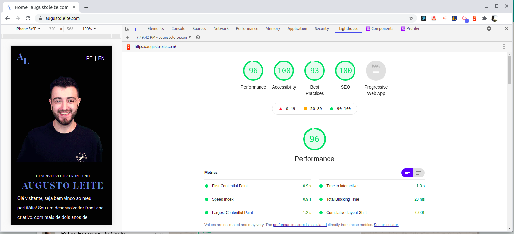

# @augustoleite.com  

<!-- ABOUT THE PROJECT -->
### Sobre o Projeto
Projeto criado para servir como portfólio demonstrando meus mais recentes projetos de maneira criativa. Utilizei o NextJS como biblioteca para otimizar a performance e obter resultados ainda melhores em relação a SEO, além disso o next me auxiliou a realizar na internacionalização do meu site sendo possível agora visualiza-lo também em inglês.

### Versão Online:
[augustoleite.com](https://augustoleite.com)

### Teste no Google Lighthouse:

### Construído com
* [ReactJS](https://en.reactjs.org/)
* [Javascript]()
* [NextJS](https://nextjs.org/)

### Biblitocas utilizadas
* [Axios](https://github.com/axios/axios)
* [Yup](https://github.com/jquense/yup)
* [Unform](https://unform.dev)
* [Styled Components](https://styled-components.com/)
* [SwiperJS](https://swiperjs.com/)
